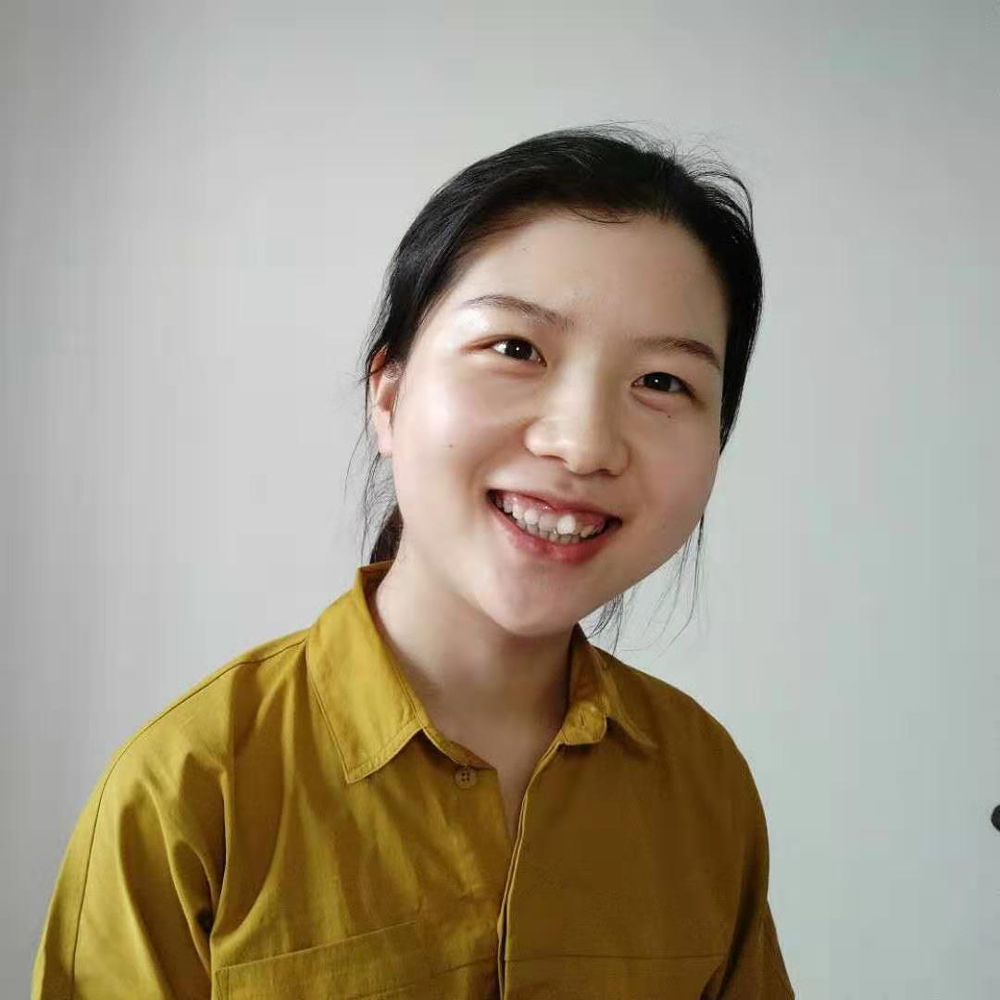

<style>
.column-left{
  float: left;
  width: 45%;
  text-align: center;
}
.column-right{
  float: right;
  width: 52%;
  text-align: justify;
}
</style>

<div class="column-left">
```{r pressure, echo=FALSE, fig.align="left",  out.width = "80%"}

```
</div>

<div class="column-right">

I am a second year PhD student at [George Tseng's Lab](http://tsenglab.biostat.pitt.edu/index.htm), Department of Biostatistics,University of Pittsburgh supervised by [Dr. George C. Tseng](http://www.pitt.edu/~ctseng/). I am also a graduate student researcher under the guidance of [Dr. Colleen McClung](http://www.mcclung.pitt.edu/) at the Department of Psychiatry, University of Pittsburgh.
</div>


